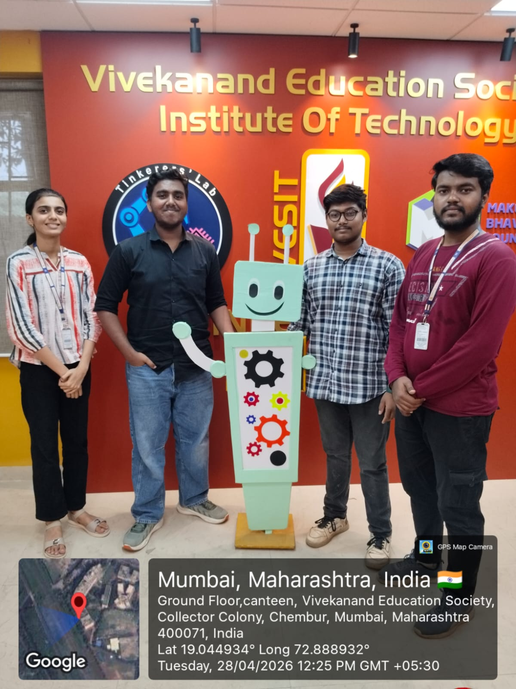
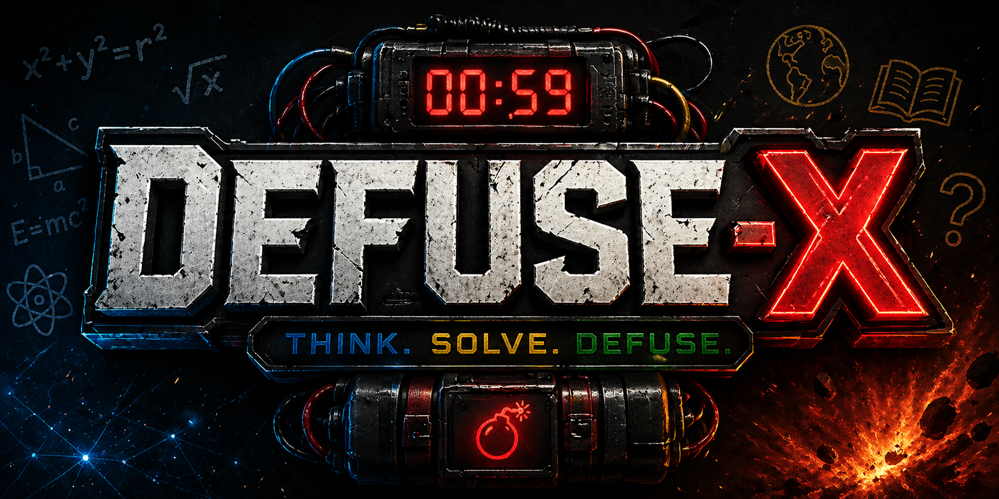
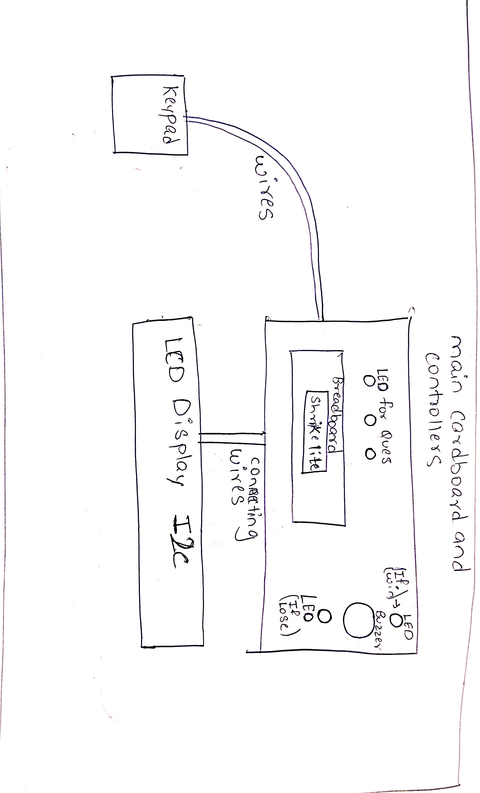
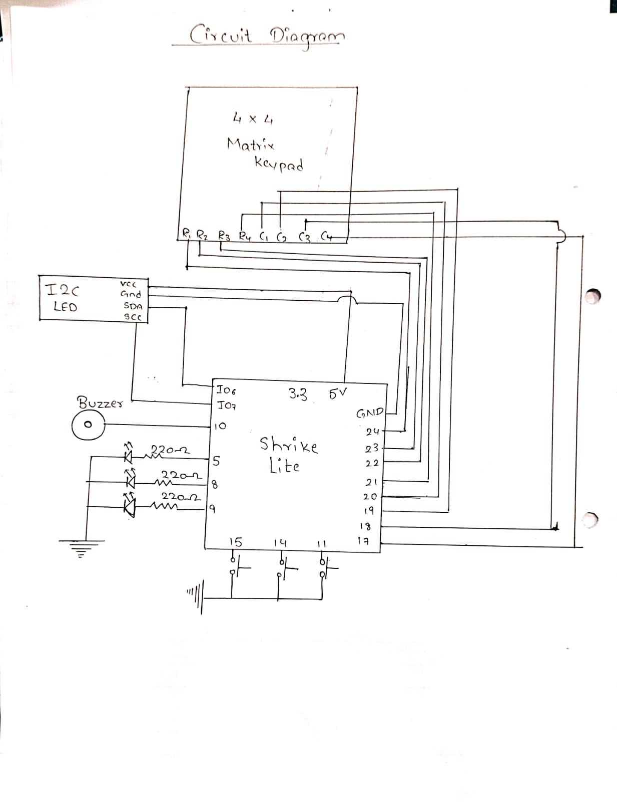
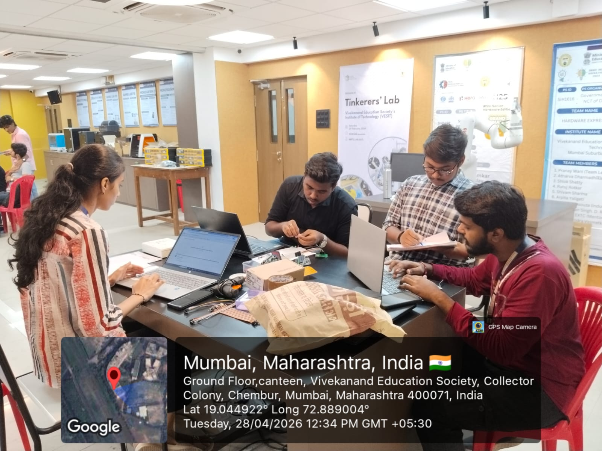
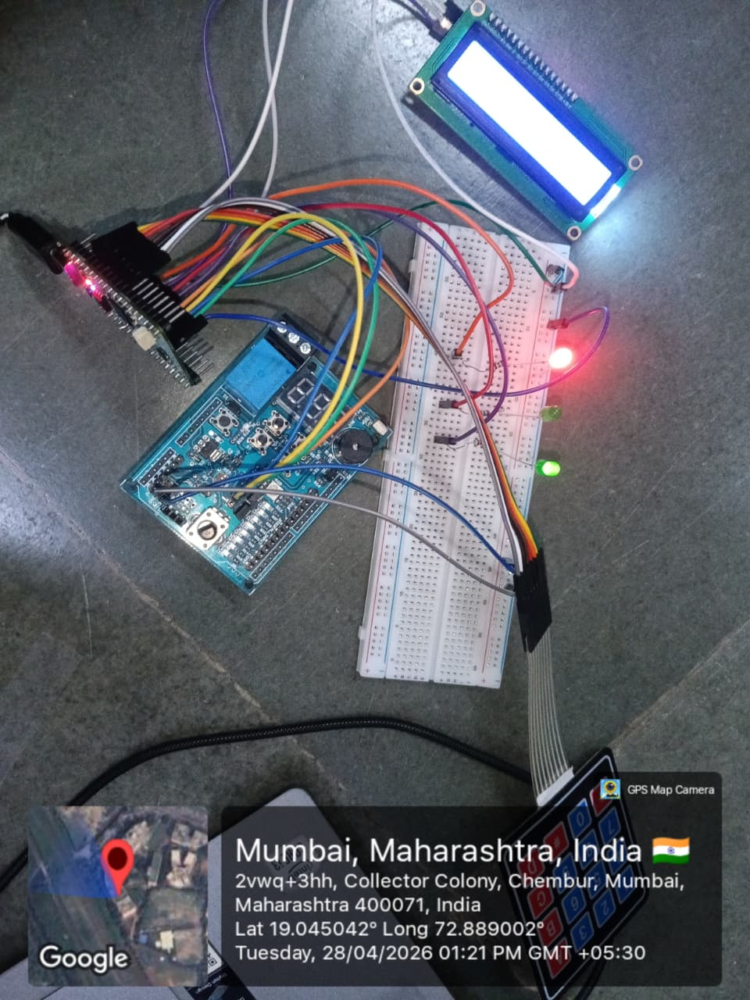
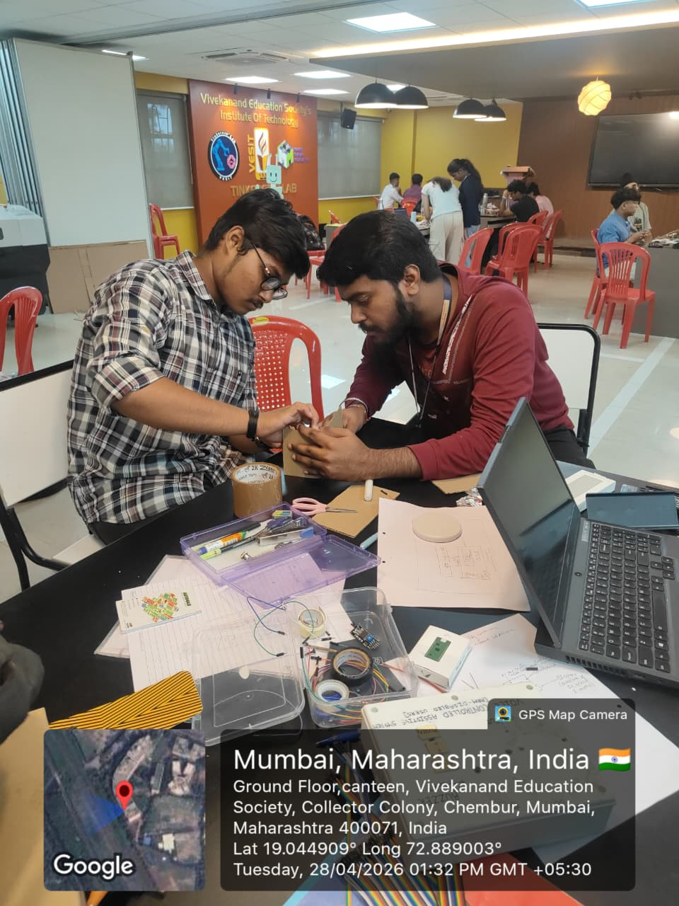
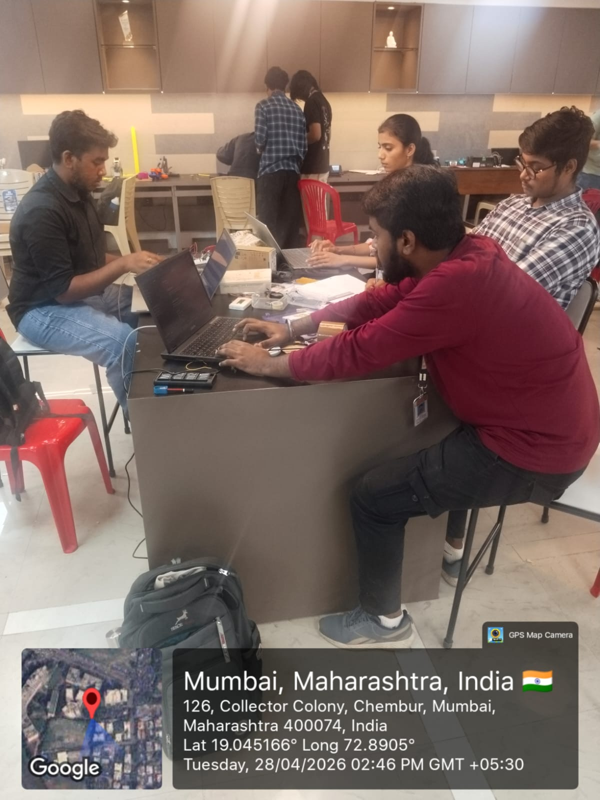
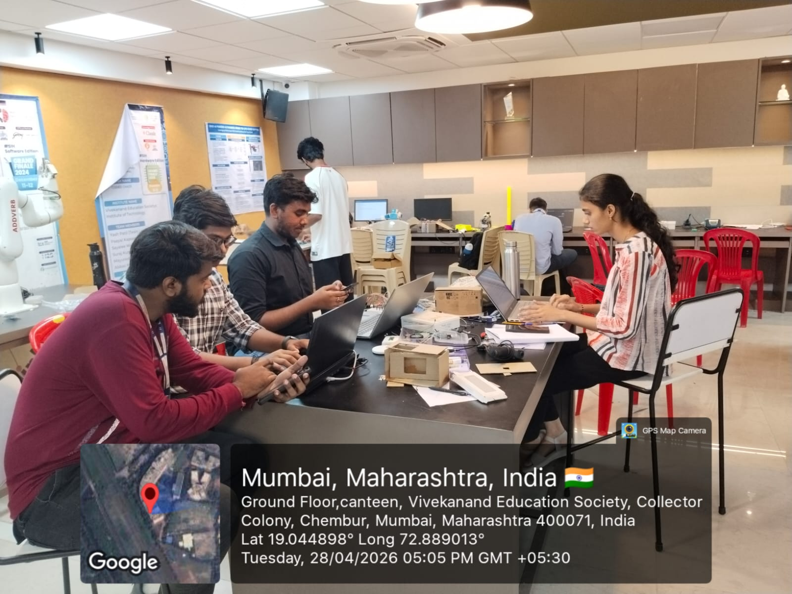
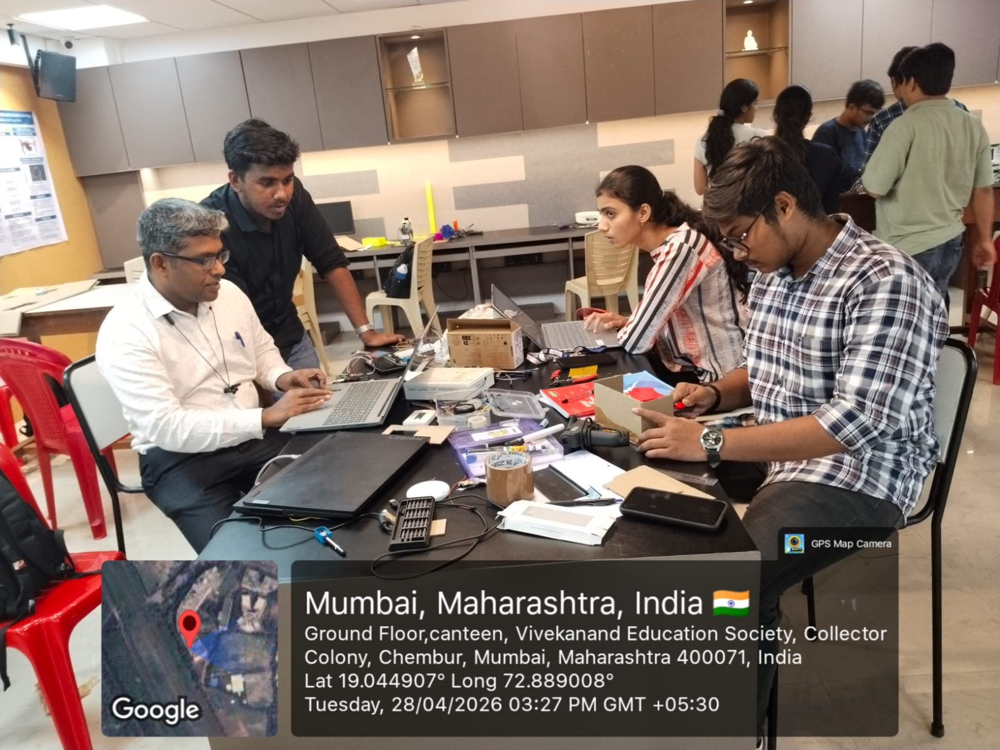

# SKILL LAB PRATICAL HACKATHON

## Final Project README

> **Project Weight:** 100%  
> **Team Size:** 4/3 students  
> **Project Duration:** 8 hours  
> **Total Time Available:** 32 effort-hours per team  
> **Project Type:** Playful, interactive, technology-based experience

---

# Before you begin

## Fork and rename this repository

After forking this repository, rename it using the format:

`SKILLLAB_PROR-2026-TeamName`

### Example

`SKILLLAB_PROR-2026-AuroWizards`

Do not keep the default repository name.

---

# How to use this README

This file is your team’s **working project document**.

You must keep updating it throughout the build period.  
By the final review, this README should clearly show:

- your idea,
- your planning,
- your design decisions,
- your technical process,
- your build progress,
- your testing,
- your failures and changes,
- your final outcome.

## Rules

- Fill every section.
- Do not delete headings.
- If something does not apply, write `Not applicable` and explain why.
- Add images, screenshots, sketches, links, and videos wherever useful.
- Update task status and weekly logs regularly.
- Use this file as evidence of process, not only as a final report.

---

# 1. Team Identity

## 1.1 Studio / Group Name

DefuseX

https://youtu.be/lA20RRszkcM

## 1.2 Team Members

| Name           | Primary Role                    | Secondary Role | Strengths Brought to the Project |
| -------------- | ------------------------------- | -------------- | -------------------------------- |
| Gauri Vichare | Documentation | Documentation | Documentation, Gift of Gab |
| Darsh Moundekar | Product Designing  | Hardware | Material Handling, Hardware  |
| Aditya Sasane | Hradware | Coding | Material Handling , hardware|
| Pratham Talole | Research   |Documentation  | Material handling, Gift of Gab   |

## 1.3 Project Title

DefuseX- Bomb Defusal game



## 1.4 One-Line Pitch

“A fast-paced quiz game where math, science, and general knowledge skills are tested under a ticking countdown.”

## 1.5 Expanded Project Idea

In 1–2 paragraphs, explain:

- what your project is,
- what kind of experience it creates,
- what technologies are involved.

**Response:**  
DefuseX– Interactive Quiz Defusal System is an Arduino-based interactive device that turns traditional quizzes into a fast-paced, game-like experience. It presents users with questions from Mathematics, Science, and General Knowledge (GK) on a display, where they must enter answers using a keypad within a limited time. A countdown timer creates urgency, while a buzzer and LED indicators provide real-time feedback for correct or incorrect responses. This transforms simple question-solving into an engaging challenge where users must think quickly and accurately to progress.

The system creates a high-pressure, immersive learning environment that enhances knowledge, reaction speed, and decision-making skills. Built using an Arduino microcontroller programmed in Embedded C/C++, the project integrates hardware components such as a keypad, display, buzzer, and LEDs through real-time input-output control. By combining concepts of embedded systems, human-computer interaction, and game logic, the project delivers an effective example of edutainment, making learning interactive, dynamic, and enjoyable.

---

# 2. Philosophy Fit

## 2.1 Experience, Not Social Problem

This module does **not** require your project to solve a large social problem.

You are allowed to build:

- toys,
- games,
- interactive objects,
- playful machines,
- kinetic artifacts,
- humorous devices,
- strange but delightful experiences,
- things that are entertaining to use or watch.


# 3. Inspiration

## 3.1 References

List what inspired the project.

| Source Type | Title / Link                                                        | What Inspired You                                                                         |
| ----------- | ------------------------------------------------------------------- | ----------------------------------------------------------------------------------------- |
| AI CHATGPT  | https://chatgpt.com/share/69f03b77-c5d8-83e8-88b4-737d4e09ca13     | We were inspired to create a system where every second tests both intelligence and decision-making.|
|             |                                                                     |                                                                                           |
|             |                                                                     |                                                                                           |

## 3.2 Original Twist

What makes your project original?
Our project is original because it converts normal math practice into an interactive hardware-based game with a timer, keypad input, and mission-based learning that makes problem solving more engaging and enjoyable.


---

# 4. Project Intent

## 4.1 User Journey 

Input:

The system receives input from the user through a matrix keypad and control buttons. The user enters numerical answers for Mathematics questions and selects options for Science and General Knowledge questions. The start button is used to begin the game, and reset buttons can be used to restart the system if required.

Processing:

The Arduino microcontroller acts as the main controller of the product. It stores question sets for Mathematics, Science, and General Knowledge. When the game starts, the controller runs the countdown timer, displays questions one by one, checks the answers entered by the user, calculates the score, and decides whether the user has passed or failed the mission. It also controls warning signals when wrong answers are entered or when time is low.

Output:

The output is provided through an LCD display, LEDs, and a buzzer. The LCD screen shows welcome messages, instructions, questions, timer status, score, and final results. LEDs are used for status indications such as correct answers, warning signals, or low remaining time. The buzzer gives sound feedback for wrong answers, alerts, and final success or failure indications.

Physical Structure:

The product is built using an Arduino board connected to a matrix keypad, LCD display, LEDs, buzzer, push buttons, and power supply. All components are mounted on a breadboard or enclosed in a prototype box to make the system compact and user-friendly. The keypad is placed on the front side for easy access, while the display is positioned clearly for reading questions and timer values.

                                                  |


---

# 5. Definition of Success

## 5.1 Definition of “Usable”


## 5.2 Minimum Usable Version

What is the smallest version of this project that still delivers the core experience?

The smallest version would keep only the essential parts needed for the main idea: solve, respond, complete the mission.

Arduino board → to control the game logic
4x4 Matrix Keypad → for entering answers
16x2 LCD display → to show questions and timer
Buzzer → for wrong answer and time-up alert

No extra LEDs, no advanced casing, no wireless modules, and no additional sensors. Just a simple breadboard setup with the main components connected.


## 5.3 Stretch Features

What features are nice to have but not essential?
Difficulty levels → Easy, Medium, and Hard modes with different timer speed and question complexity.
Score memory → save highest score using EEPROM memory.
Sound effects module → ticking sound, success tone, or game over sound.
Battery power supply → makes the device portable.
Project enclosure/casing → gives a professional finished look.
Bluetooth / Wi-Fi module → connect to mobile app for score tracking or control.
Multiplayer mode → two players can compete one after another.
Additional subjects → more Science, GK, or puzzle rounds.
Voice guidance → spoken instructions or alerts.
Reset and mode buttons → easier operation for selecting rounds.

These features improve the product experience and appearance, but the project can still deliver its main gameplay without them.

---

# 6. System Overview

## 6.1 Project Type

Check all that apply.

- [x] Electronics-based

- [ ] Mechanical

- [x] Sensor-based

- [] App-connected

- [] Motorized

- [x] Sound-based

- [x] Light-based

- [x] Screen/UI-based

- [x] Fabricated structure

- [x] Game logic based

- [] Installation

- [ ] Other:

## 6.2 High-Level System Description

Explain how the system works in simple terms.
1)When the device is switched on, the Arduino starts the system and shows a welcome message on the display. The LEDs may blink to show that the game is ready.
2)The user presses the start button or keypad key to begin the game. A countdown timer starts running on the 7-segment display.
3)Questions from Mathematics, Science, or General Knowledge are shown on the LCD display one by one.
4)The user enters answers using the matrix keypad. For math questions, numbers are typed directly. For Science and GK questions, the user selects the correct option using the keypad.
5)The Arduino checks whether the answer is correct or wrong.
6)If the answer is correct, the system moves to the next question and may turn on a green LED.
7)If the answer is wrong, the buzzer sounds and a warning LED may glow.
8)The user continues answering questions until the timer ends or all questions are completed.
9)At the end, the display shows the final result such as mission success or mission failed, based on the score.
10)Overall, the system combines learning and gaming by using a timer, keypad input, display output, LEDs, buzzer, and Arduino control.


## 6.3 Input / Output Map

| System Part                              | Type             | What It Does                                    |
|Vicharak Shrike                           | Processing       |Executes game logic                              |
|Arduino io shield                         |INPUT AND OUTPUT  | executes operation                              |
|LCD                                       |Output            | Displaying in                                   |
|LED's                                     | OUTPUT           | Indication                                      |
|Physical Structure                        | Structural       |Taking all components in neat way                |

---

# 7. Sketches and Visual Planning

## 7.1 Concept Sketch

Add an early sketch of the full idea.

**Insert image below:**  
`[Upload image and link here]`

Example:

```md

```


## 7.2 Labeled Build Sketch

Add a sketch with labels showing:

- structure,
- electronics placement,
- user touch points,
- moving parts,
- output elements.

**Insert image below:**  
`[Upload image and link here]`


## 7.3 Approximate Dimensions

| Dimension        | Value   |
| ---------------- | ------- |
| Length           | `18 cm` |
| Width            | `8 cm` |
| Height           | `10 cm`  |
| Estimated weight | `400 g` |

---

# 8. Electronics Planning

## 8.1 Electronics Used

| Component                 | Quantity | Purpose                               |
| ------------------------- | --------:| ------------------------------------- |
| Vicharak Shrike Lite      | `1`      | `[Main controller]`                   |
| 4x4 Matrix Keypad         | `1`      | `[For numbers]`                       |
| Buzzer                    | `2`      | `[Bomb sound]`                        |
| 16x2 I2C LCD              | `1`      | `[Display]`                           |
| Arduino IO shield         |  `1`     | `[For buttons]`                       |
| Led                       | `3`      | `[Indicators]`                        |

## 8.2 Wiring Plan

Describe the main electrical connections.
Main Electrical Connections / Wiring Plan
The circuit is centered around the Shrike Lite controller board, which is used to control all input and output components of the project. All devices are connected to this main board.
1. 4x4 Matrix Keypad Connections
   The 4x4 matrix keypad is connected to the digital input/output pins of the Shrike Lite board. The keypad has 8 terminals:
   Rows: R1, R2, R3, R4
   Columns: C1, C2, C3, C4
   These row and column lines are connected to the controller pins so that the system can detect which key is pressed.
2. I2C LCD Display Connections
The I2C LCD display is connected using four pins:
   VCC → Connected to 5V supply
   GND → Connected to Ground
   SDA → Connected to I/O pin 6
   SCL → Connected to I/O pin 7
   This display is used to show messages, questions, and game status.
3. Buzzer Connection
   The buzzer is connected between:
   Positive terminal → Digital pin 10
   Negative terminal → Ground
   The buzzer gives sound alerts for wrong answers, warnings, or game over indication.
4. LED Connections
   Three LEDs are connected as output indicators through 220Ω resistors for current protection.
   LED 1 → Pin 5
   LED 2 → Pin 8
   LED 3 → Pin 9
   The negative terminals of all LEDs are connected to Ground.
5. Push Button Connections
   Three push buttons are connected to pins:
   Button 1 → Pin 15
   Button 2 → Pin 14
   Button 3 → Pin 11
   The other side of each button is connected to Ground. These buttons may be used for start, reset, or mode selection.
6. Power Connections
   5V supply is given to the display and required modules.
   Ground is common for all components to complete the circuit.

## 8.3 Circuit Diagram

Insert a hand-drawn or software-made circuit diagram.

**Insert image below:**  
`[Upload image and link here]`



# 9. Power Plan

| Question         | Response                                                                                                                                          |
| ---------------- | ------------------------------------------------------------------------------------------------------------------------------------------------- |
| Power source     | Laptop USB power  (5V)                                                                                                                         |
| Voltage required | 5V USB supply for Shrike Lite board and connected components                                                                |
| Current concerns | USB power has limited current output. If multiple components such as LCD, buzzer, LEDs, and 7-segment display operate together, voltage drop or unstable performance may occur. Excessive current draw can also reset the controller board.                                 |
| Safety concerns  | Ensure correct wiring before powering the circuit, avoid loose connections, use resistors with LEDs, prevent short circuits, and do not overload the USB port. Keep the circuit dry and handle components carefully during testing. |

---

# 10. Software Planning

## 10.1 Software Tools

| Tool / Platform                | Purpose                                        |
| ------------------------------ | ---------------------------------------------- |
| `Arduino ide`                |     write and upload code for project                    |


## 10.2 Software Logic

Describe what the code must do.

Include:

- startup behavior,
- input handling,
- sensor reading,
- decision logic,
- output behavior,
- communication logic,
- reset behavior.

   The code starts by initializing the controller board, keypad, LCD display, 7-segment display, LEDs, buzzer, and timer. A welcome message is shown, and the system waits for the user to start the game.
   For **input handling**, the system reads the 4x4 keypad and push buttons. The keypad is used to enter answers for Math questions and select options for Science and GK questions. Buttons can be used for start or reset functions.
   There are no **external sensors** in this project. The keypad and buttons act as the main input devices.
   The **decision logic** displays questions one by one, checks the user’s answers, updates the score, and controls the timer. Correct answers move to the next question, while wrong answers activate warning signals.
   For **output behavior**, the LCD shows questions, score, and results. The 7-segment display shows the countdown timer. LEDs indicate status, and the buzzer gives warning or game over sounds.
   There is no external **communication** such as Wi-Fi or Bluetooth. The system works completely through connected hardware components.
   For **reset behavior**, when the game ends or reset is pressed, the score and timer return to default values, and the system goes back to the start screen.

-
## 10.3 Code Flowchart

Insert a flowchart showing your code logic.

Suggested sequence:

- start,
- initialize,
- wait for input,
- read input,
- decision,
- trigger output,
- repeat or reset,
- error handling.

**Insert image below:**  


# 11. Bill of Materials

## 11.1 Full BOM

| Item                             | Quantity | In Kit? | Need to Buy? | Estimated Cost | Material / Spec               | Why This Choice?          |
| -------------------------------- | --------:| ------- | ------------ | --------------:| ----------------------------- | ------------------------- |
| Vicharak Shrike                  | `1`      | `Yes`   | `No`         | `0`            | 38 Pin SHRIKE LITE            | `[To control components]` |
| Arduino io shield                | `1`      | `[Yes]`   | `[No]`     | `0`            |arduino extension board        | `[to execute code]`  |
| 16X2 LCD display                 | `2`      | `[No]`    | `[Yes]`    | `[10]`         | Low-pin interface, displays text for options and feedback | `[better displaty of questions ]`    |
| 4x4 Matrix keypad                | `1`      | `[No]`    | `[Yes]`     | `[75]`        | 8 pins keypad                 |  for entering numbers                         |
| LED                              | `3`      | `[No]`    | `[Yes]`     | `[15]`        | light emiiting device         |indication                           |

## 11.2 Material Justification

Explain why you selected your main materials and components.

  - The Vicharak Shrike Lite board was selected as the main controller because it is suitable for embedded system projects and can easily interface with multiple input and output devices. It controls the complete game logic, timer, and user interaction.
  -The 4x4 matrix keypad was chosen because it provides a simple and efficient method for entering numerical answers and selecting options using fewer controller pins.
  -The 16x2 LCD display was selected to show questions, instructions, score, and game messages clearly in real time. It provides an easy-to-read interface for the user.
  -The 7-segment display was used to show the countdown timer separately, making the remaining time more visible during gameplay.
  -LEDs were chosen as visual indicators for correct answers, warnings, and game status because they are simple, low-cost, and effective.
   -The buzzer was selected to provide sound alerts for wrong answers, low time warnings, and game over indications, making the product more interactive.
   -Push buttons and connecting wires were used for start, reset, and circuit connections, while a cardboard or box enclosure was chosen to give the prototype a neat and compact structure.


## 11.3 Items You chose

| Item                 | Why Needed               | Purchase Link | Latest Safe Date to Procure | Status       |
| -------------------- | ------------------------ | ------------- | --------------------------- | ------------ |
| Vicharak shrike | instruction   | `robu.in`     | `15th April`                | `[Received]` |
| Arduino io shield    | Execution of program| `local store` | `before testing`            | `[Received]` |
| LCD display| Displaying questions and output         | `local store` | `before testing`            | `Recieved`   |

## 11.4 Budget Summary

| Budget Item           | Estimated Cost              |
| --------------------- | ---------------------------:|
| Electronics           | `[400]`                     |
| Fabrication materials | `[0 (Available on campus)]` |
| Purchased extras      | `[180]`                       |
| Contingency           | `[300]`                     |
| **Total**             | `[900]`                     |

## 11.5 Budget Reflection

If your cost is too high, what can be simplified, removed, substituted, or shared?
If the total project cost becomes too high, several lower-cost alternatives can be used without affecting the main concept of the product.
The Vicharak Shrike Lite board can be replaced with a lower-cost Arduino Nano or Arduino Uno compatible board for basic control functions.
The 16x2 LCD display can be replaced with a smaller display or a simple serial monitor output during testing.
The 7-segment display can be removed, and the countdown timer can be shown directly on the LCD screen instead.
The 4x4 matrix keypad can be replaced with a 4-button keypad or fewer push buttons for answer selection.
Multiple LED indicators can be reduced to one common LED for status indication.
The buzzer can be replaced with a basic piezo buzzer, which is lower in cost.
Instead of a custom enclosure, a simple cardboard box or recycled material can be used for the outer structure.
By using these alternatives, the project cost can be reduced while still maintaining the core experience of a mission-based educational game. 

---

# 12. Planning the Work

## 12.1 Team Working Agreement

Write how your team will work together.


## 12.2 Task Breakdown

| Task ID | Task                                | Owner    | Estimated Hours | Phase time    | Dependency | Status |
| ------- | -----------------------             | -------- | ---------------:| ------------  | ---------- | ------ |
| T1      | Ideation & Concept Finalization`    | All      | `2`             |2 hrs           | `None`     | `Done` |
| T2      |Core Implementation                  | Aditya   | `2`             |2 hrs           | T1         | `Done` |
| T3     | Documentation (Report writing)`      | Gauri    | 4 hours (side by side) |4hrs |T1,T2            | `Done` |
| T4     | PPT Preparation                     |Darsh ,pratham ,gauri | half hr     |half hr  | T1,T2,T3`| `Done` |
| T5      | Hardware assembly    |Aditya     | `2`             |2 hrs           | T1,T2,T3,T4 | `Done` |
| T6      |Testing and debugging             | Aditya   | `2`             |2 hrs           | T1 ,T2,T3,T4,T5       | `Done` |

## 12.3 Responsibility Split

| Area                 | Main Owner | Support Owner |
| -------------------- | ---------- | ------------- |
| Concept              | `[Darsh]`  | `[Gauri,Aditya,pratham]`    |
| Electronics          | `[Aditya]`       | `[darsh, pratham]`     |
| Coding               | `[Aditya]`       | `[darsh]`     |
| Testing              | `[Aditya]`       | `[gauri,pratham,darsh ]`    |
| Documentation        | `[Gauri]`       | `[Gauri]`     |

---

# 13. 2 hour Milestones
In the first two hours, the following work was covered:
Finalized the project idea and confirmed the concept of a mission-based quiz game using Math, Science, and GK questions.
Discussed the required components and prepared the hardware setup.
Connected the Vicharak Shrike Lite board with the breadboard and power supply.
Completed wiring of the 4x4 matrix keypad for user input.
Connected the 16x2 LCD display for showing questions and messages.
Connected the 7-segment display for timer indication.
Added LEDs and buzzer for alerts and status signals.
Started coding the basic game logic including startup screen and timer.
Tested keypad input and LCD output functionality.
Corrected wiring and minor coding issues during initial testing.
Achieved a basic working prototype where the system powers on and accepts user input.


## 13.1 8-hour Plan

### Bi Hour 1 — Plan and De-risk

Expected outcomes:

- [x] Idea finalized
- [x] Core interaction decided
- [x] Sketches made
- [x] BOM completed
- [x] Purchase needs identified
- [ ] Key uncertainty identified
- [x] Basic feasibility tested

### Bi Hour 2 — Build Subsystems

Expected outcomes:

- [x] Electronics tests completed
- [ ] CAD / structure planning completed
- [ ] App UI started if needed
- [] Mechanical concept tested
- [x] Main subsystems partially working

### Bi Hour 3 — Integrate

Expected outcomes:

- [x] Physical body built
- [x] Electronics integrated
- [x] Code connected to hardware
- [ ] App connected if required
- [x] First playable version exists

### Bi Hour 4 — Refine and Finish

Expected outcomes:

- [x] Technical bugs reduced
- [x] Playtesting completed
- [x] Improvements made
- [x] Documentation completed
- [x] Final build ready

## 13.2  Update Log

| HOUR   | Planned Goal   | What Actually Happened | What Changed   | Next Steps     |
| ------ | -------------- | ---------------------- | -------------- | -------------- |
| HOUR 1 | `[Write here]` | `[Write here]`         | `[Write here]` | `[Write here]` |
| HOUR2 | `[Write here]` | `[Write here]`         | `[Write here]` | `[Write here]` |
| HOUR 3 | `[Write here]` | `[Write here]`         | `[Write here]` | `[Write here]` |
| HOUR 4 | `[Write here]` | `[Write here]`         | `[Write here]` | `[Write here]` |

---

# 14. Risks and Unknowns

## 14.1 Risk Register

| Risk                                                            | Type         | Likelihood | Impact   | Mitigation Plan                                                                        |
| --------------------------------------------------------------- | ------------ | ---------- | -------- | ------------------------------------------------------------------------------------- | -------------------- |
| LCD display didnt supported                                     | `Technical`  | `Medium`   | High  |  improve wiring stability,correction has done in the code|
|4X4 matrix keypad did'nt supported                               | `Technical`  | `Medium`   | High  |  improve wiring stability,correction has done in the code,libraries has been installed|

## 14.2 Biggest Unknown Right Now

What is the single biggest uncertainty in your project at this stage? 


**Response:**  


---

# 15. Testing 

## 15.1 Technical Testing Plan

| What Needs Testing     | How You Will Test It                                                                 | Success Condition                                                                                    |
| ---------------------- | ------------------------------------------------------------------------------------ | ---------------------------------------------------------------------------------------------------- |
| Code | checking if there is no any error| code succesfully tested and is without error    
| LCD screen | by correcting the connections and the proper code| code corrected succefully and connections too  |
| 4X4 matrix keypad| checking the connections | connections checked properly
                       |
## 15.2 Testing and Debugging Log

| Date          | Problem Found                         | Type         | What You Tried                                | Result               | Next Action                                    |
| ------------- | ------------------------------------- | ------------ | --------------------------------------------- | -------------------- | ---------------------------------------------- |
| 28 april | LCD not working     | `Mechanical` | reducing error ,downloding proper libraries | `Worked`             | improved code and connection                    |
| 28 april | 4x4 keypad not working     | `Mechanical` |making proper connections and correctiing code | `Worked`             | improved code and connection                    |

## 15.3 Playtesting Notes

| Tester      | What They Did                        | What Confused Them                    | What They Enjoyed                         | What You Will Change                          |
| ----------- | ------------------------------------ | ------------------------------------- | ----------------------------------------- | --------------------------------------------- |
| Aditya | corrected the error | code and connection| correcting the connections and code| nothing |
|Gauri| corrected the documentation |Using git |Understanding git| nothing |
| Pratham| researched on prototype|nothing| Researching| nothing |
|Darsh| Researched and hardware  | code and connection| researching and connection| nothing |
---

# 16. Build Documentation

## 16.1 Fabrication Process

Describe how the project was physically made.

Include:

- cutting,
- 3D printing,
- assembly,
- fastening,
- wiring,
- finishing,
- revisions.

**Response:**  
The fabrication process involved planning, assembling, wiring, and refining both the physical structure and electronic setup of the project.
Design and Layout:
The initial layout of the project was planned by arranging the Shrike Lite board, keypad, LCD display, 7-segment display, LEDs, and buzzer in suitable positions. Proper spacing was considered so that the user could easily view the displays and operate the keypad.
Cutting:
Cardboard or mounting sheet material was measured and cut according to the required dimensions to create the base platform and outer enclosure for the prototype. Openings were made for the LCD display, keypad, and LEDs.
Assembly:
All components were placed on the base structure and aligned properly. The controller board, display modules, keypad, and other parts were arranged in a user-friendly manner for smooth operation.
Fastening:
Components were fixed using glue, double-sided tape, screws, or cable ties depending on availability. This ensured that the parts remained stable during use and testing.
Wiring:
Electrical connections were completed using jumper wires between the Shrike Lite board and all modules such as keypad, LCD display, 7-segment display, LEDs, and buzzer. Power and ground connections were checked carefully before testing.
Finishing:
Loose wires were arranged neatly, unnecessary gaps were covered, and the enclosure was cleaned for a better final appearance. Labels or markings were added where necessary for buttons and controls.
Revisions and Improvements:
Several changes were made during fabrication, including correcting wiring issues, adjusting component positions, improving display visibility, and modifying the enclosure for easier access. Repeated testing helped improve the final structure and working condition of the project.
## 16.2 Build Photos

Add photos throughout the project.

Suggested images:

- early sketch,
- prototype,
- electronics testing,
- mechanism test,
- app screenshot,
- final build.








# 17. Final Outcome

## 17.1 Final Description

Describe the final version of your project.

The final version of our project is a mission-based educational quiz game using the Vicharak Shrike Lite board. It includes a 4x4 matrix keypad for user input, 16x2 LCD display for questions, 7-segment display for timer, LEDs for indicators, and a buzzer for alerts.
The user answers Math, Science, and GK questions within limited time. Correct answers increase the score, while wrong answers give warning signals. At the end, the system displays Mission Success or Mission Failed.
The project combines learning, gaming, and hardware interaction in a compact prototype. 


## 17.2 What Works Well
The core game concept works well and is engaging, as it combines learning, quick thinking, and interaction in one system. The Shrike Lite board successfully handles input, timer logic, question processing, and output control as a complete embedded system. The 4x4 matrix keypad provides a simple and effective way for users to enter answers and select options.

The LCD display clearly shows questions, instructions, and results, while the 7-segment display gives an easy-to-read countdown timer. LEDs and buzzer provide clear visual and sound feedback for correct answers, warnings, and game status.

The project demonstrates strong integration of hardware and software, where all components work together smoothly to create a complete interactive educational product.


## 17.3 What Still Needs Improvement

Some areas of the project can still be improved for better performance and user experience. The response speed of the keypad can be made faster and more accurate during quick input. The LCD display interface can be improved with better formatting and smoother question transitions.

The wiring setup can be made more compact and organized by using a proper PCB or cleaner enclosure instead of breadboard connections. Sound effects and LED indications can be enhanced to make the game more interactive and attractive.

Additional features such as multiple difficulty levels, score memory, more question categories, and multiplayer mode can be added in future versions. A stronger outer casing and battery power option would also make the product more portable and professional.
## 17.4 What Changed From the Original Plan

How did the project change from the initial idea?

The project evolved during the planning and development stages. The initial idea was focused only on a simple math-based quiz system. Later, the concept was improved into a mission-based educational game that includes Mathematics, Science, and General Knowledge questions to make the product more interactive and useful.

The hardware setup also changed during development. Additional components such as the 7-segment display, LEDs, and buzzer were added to improve timer visibility, alerts, and user experience. The keypad remained the main input device, while the LCD display was used for better question presentation.

The gameplay logic was also upgraded from a basic question-answer system to a timed challenge format with score checking, warning signals, and final success or failure results.

Overall, the project changed from a simple quiz idea into a more complete and engaging educational game with improved hardware integration and clearer gameplay features.


---

# 18. Reflection

## 18.1 Team Reflection

What did your team do well?  
What slowed you down?  
How well did you manage time, tasks, and responsibilities?

   Our team worked together in a cooperative and effective manner, which made the project easier to complete. Every member contributed according to their skills and interests. Responsibilities such as documentation, coding, hardware setup, research, testing, and idea development were shared among the team members. This division of work reduced the burden on one person and helped us complete tasks more efficiently.
   One of the main strengths of our team was good communication and mutual understanding. Each member clearly explained what they were working on, which helped everyone stay updated about the project progress. Whenever any member faced a difficulty, the others supported by giving suggestions or helping practically. This teamwork created a positive working environment and improved coordination.
   The main factors that slowed down our project were technical issues with the LCD display and the 4x4 matrix keypad. During setup and testing, these components required extra time for troubleshooting, wiring checks, and code corrections. Although these problems caused some delay, they were solved through repeated testing and teamwork.
   At the beginning of the project, all team members shared ideas and discussed possible improvements. After considering different suggestions, the final project idea was selected through mutual understanding. This made sure that every member was involved in the decision-making process.
   Once the idea was finalized, tasks were divided according to interests and strengths. One member handled documentation, another focused on coding, one worked on research, and another managed hardware connections. Even though tasks were divided, every member helped each other whenever needed.
   In terms of time management, splitting the work into smaller tasks helped us stay organized and complete the project on time. Regular discussions and responsible task handling made the work smoother. Overall, the project helped us improve not only technical skills but also teamwork, planning, and responsibility.


## 18.2 Technical Reflection

What did you learn about:

- electronics,
- coding,
- mechanisms,
- fabrication,
- integration?

Through this project, we learned important practical skills in different technical areas.

In electronics, we learned how to connect and interface components such as the Shrike Lite board, keypad, LCD display, 7-segment display, LEDs, and buzzer. We also understood the importance of proper wiring, power supply connections, resistors, and troubleshooting hardware issues.

In coding, we learned how to write and organize embedded system programs for handling keypad input, displaying questions, controlling timers, checking answers, and managing outputs such as LEDs and buzzer. We also improved our debugging skills while solving errors during testing.

In mechanisms, we learned how different input and output devices work together as one system. We understood how user actions through the keypad are processed and converted into visual or sound responses.

In fabrication, we learned how to physically arrange components, prepare the enclosure, mount modules properly, and keep the setup neat and user-friendly. We also learned the importance of planning component placement before final assembly.

In integration, we learned how to combine hardware, software, and physical structure into one complete working product. This helped us understand real-world system design where multiple modules must work together smoothly. 


## 18.3 Design Reflection

What did you learn about:

- designing ,
- delight,
- clarity,
- physical interaction,
- understanding,
- iteration?

In designing, we learned how to plan a product by arranging components in a simple, organized, and user-friendly layout. We understood that good design is not only about appearance but also about functionality and ease of use.

In delight, we learned that adding elements such as timer challenges, LEDs, buzzer sounds, and mission-based gameplay makes the product more enjoyable and exciting for users. Small interactive features can greatly improve the overall experience.

In clarity, we learned the importance of clear instructions, readable display messages, and simple controls so that users can understand how to play without confusion. A clear interface improves usability.

In physical interaction, we learned how users connect with the product through the keypad, buttons, and displays. Good placement of controls and displays makes interaction smoother and more comfortable.

In understanding, we learned that designing for users requires thinking from their point of view. The product should be easy to understand, responsive, and engaging for first-time users.

In iteration, we learned that the first version is rarely perfect. Repeated testing, improvements, and changes in wiring, coding, and layout helped us create a better final product.


## 18.4 If You Had One More hour

What would you improve next?

**Response:**  
If we had one more hour, we would focus on improving the overall finish and adding extra features to the project. We would make the wiring cleaner and more organized for a better professional look. The outer enclosure would be improved to make the prototype stronger and more attractive.

We would also add more questions for Mathematics, Science, and General Knowledge to increase gameplay variety. The LCD display messages and timer interface could be improved for better clarity. Sound effects and LED indications could be enhanced to make the game more interactive.

Additional features such as difficulty levels, score memory, and smoother reset functions could also be added. Extra testing time would help us remove minor errors and improve the final user experience.
` `

---

# 19. Final Submission Checklist

Before submission, confirm that:

- [x] Team details are complete
- [x] Project description is complete
- [x] Inspiration sources are included
- [x] Sketches are added
- [x] BOM is complete
- [x] Purchase list is complete
- [x] Budget summary is complete
- [x] Mechanical planning is documented if applicable
- [ ] App planning is documented if applicable
- [x] Code flowchart is added
- [x] Task breakdown is complete
- [x] Weekly logs are updated
- [x] Risk register is complete
- [x] Testing log is updated
- [x] Playtesting notes are included
- [x] Build photos are included
- [x] Final reflection is written


---


---


